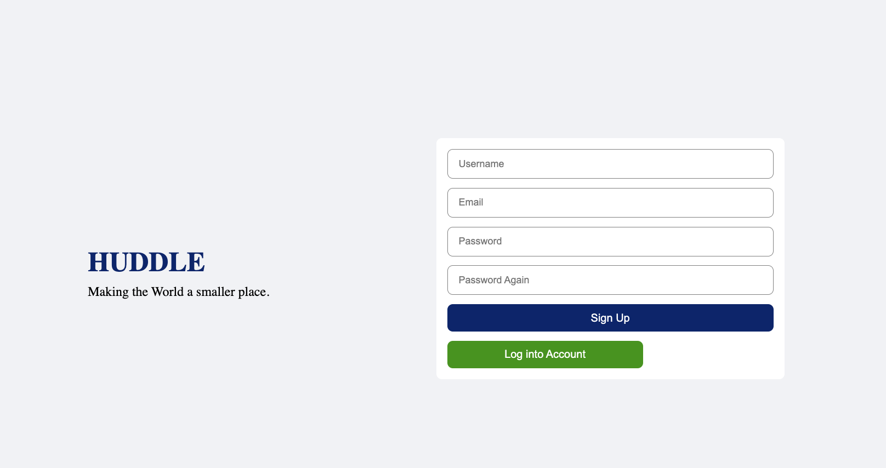
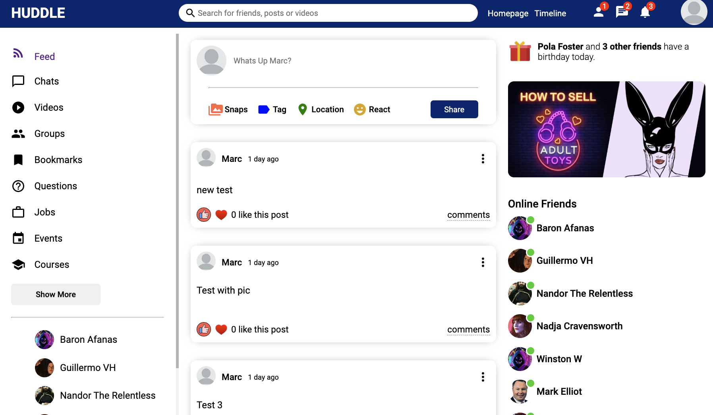

# HUDDLE Social Media App

## [HUDDLE Social Media](https://github.com/Fishgif/project-3-ui)
## License

## Description
This app has been created to allow family and friends who do not live near one another communicate in a safe and secure environment. the app allows you to follow and un follow friends, communicate by sharing your thoughts and images. This app is a full stack M.E.R.N application.

## Table of Contents 
* [License](#license)
* [Description](#description)
* [Screen Shots](#screen-shots)
* [Technologies](#technologies)
* [Structure](#structure)
* [Scripts](#scripts)
* [Packages](#packages)
* [Database](#database)
* [Test](#test)
* [Credits](#credits)
* [Deployment](#deployment)

## Screen Shots

### UI

## Technologies
- React
- JavaScript
- npm
- Material icons
- CSS

## Structure
MVC

## Scripts
Standard Create React App

## Packages
"@emotion/react": "^11.9.3",
    "@emotion/styled": "^11.9.3",
    "@material-ui/core": "^4.11.3",
    "@material-ui/icons": "^4.11.2",
    "@testing-library/jest-dom": "^5.11.4",
    "@testing-library/react": "^11.1.0",
    "@testing-library/user-event": "^12.1.10",
    "axios": "^0.21.1",
    "react": "^17.0.2",
    "react-dom": "^17.0.2",
    "react-router": "^5.2.0",
    "react-router-dom": "^5.2.0",
    "react-scripts": "4.0.2",
    "timeago.js": "^4.0.2",
    "web-vitals": "^1.0.1"

## Database
MongoDB

## Test
N/A

## Credits

### [Marc Github](https://github.com/Fishgif)

## Deployment

[Data Base](https://huddle-social-media.herokuapp.com/)
[UI](https://dapper-madeleine-783831.netlify.app)
[Github](https://github.com/Fishgif/project-3-ui)
[Github](https://github.com/Fishgif/project-3)

